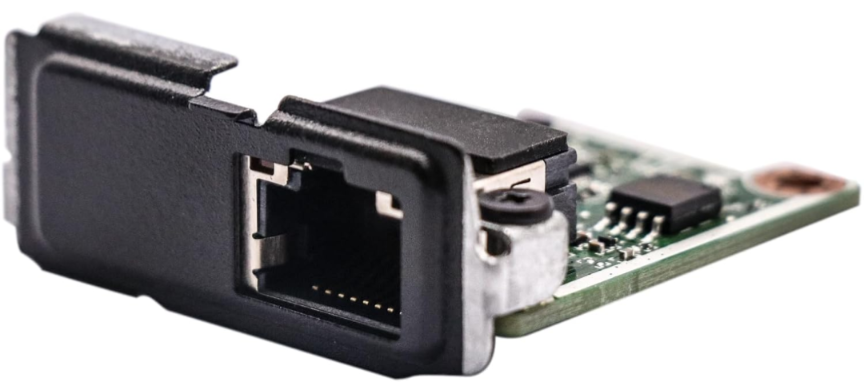
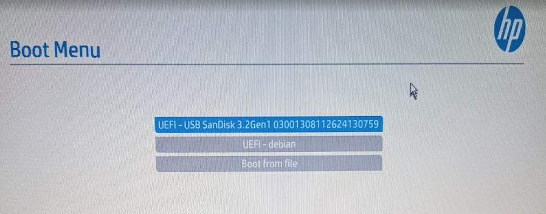
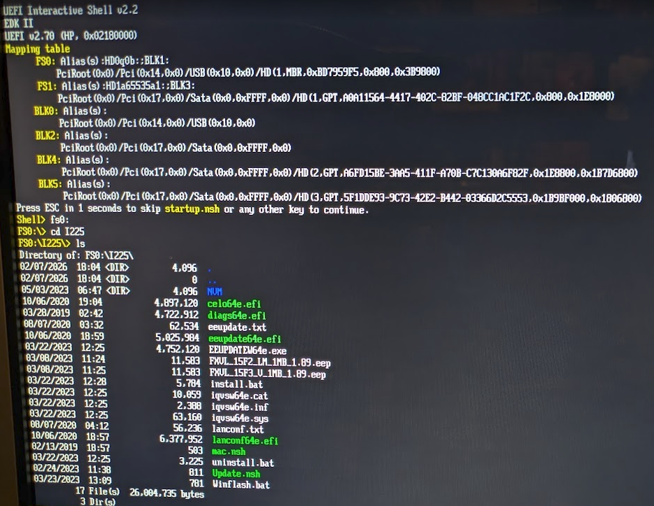
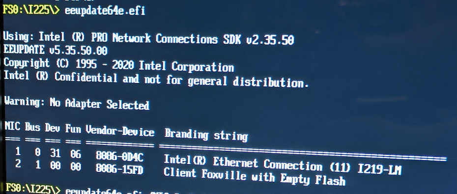
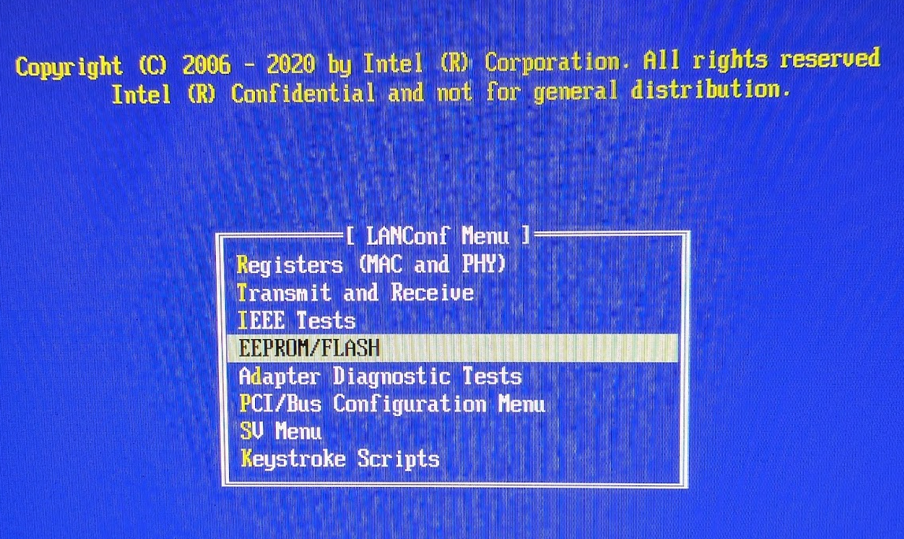
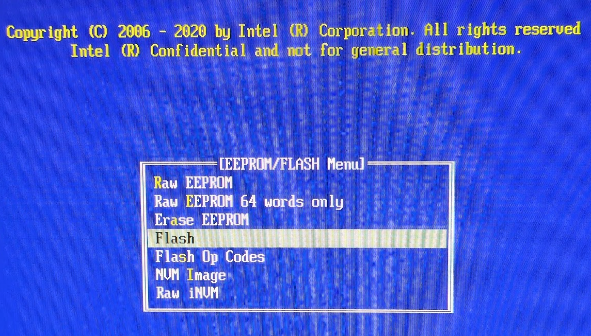
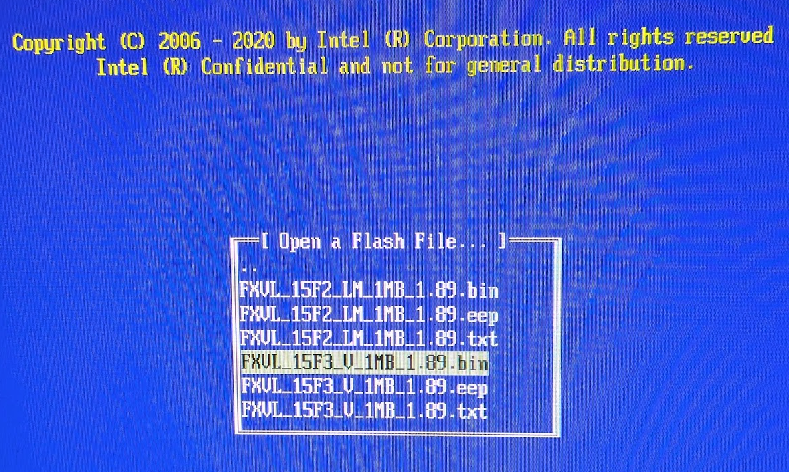

# HP 2.5GbE Flex IO V2 Flash Procedure
## Flashing steps for the HP EliteDesk Mini 2.5GbE Intel I225-V (M74416 / L83414-002) V2 Flex IO adapter.

This was tested on a HP EliteDesk Mini 800 G6 with the HP Flex IO 2.5GbE v2 (Intel I225-V, M74416 / L83414-002) adapter. The adapter came with a blank/invalid flash memory and would not be recognized under any operating system, other than having a visible hardware ID within the PCI tree. This tutorial requires no CH341A SOIC flash tool, and just requires a small USB flash drive. This method may also be adaptable to other vendors/models assuming you have the appropriate files. I know there are many issues with this NIC on other platforms.

1. Create a UEFI shell boot drive: https://github.com/KilianKegel/Howto-create-a-UEFI-Shell-Boot-Drive

2. Create a folder on your UEFI shell boot drive called "I225".

3. Extract the files from "intel_i225_1.89.zip" into the "I225" folder on the UEFI shell boot drive.

4. Safely eject the USB drive from your PC.

5. Insert the UEFI shell boot USB drive into an open USB port on your HP EliteDesk Mini.

6. Power on the HP EliteDesk Mini and start pressing F9 to access the boot menu.

7. Choose your UEFI shell boot drive from the menu.

8. At the UEFI shell prompt, navigate to your storage location for the Intel Firmware files. Example: "fs0:" and press enter, then "cd I225" and press enter. Type "dir" or "ls" to view the files.

9. At the UEFI shell prompt, type "eeupdate64e.efi" and press enter. You should see the "Client Foxville with Empty Flash" line listed in the network adapters list. Verify it is there. If not, power off the computer and reseat the adapter. If it still doesn't show up, there is likely a physical hardware problem.

10. At the UEFI shell prompt, type "lanconf64e.efi".

11. Select the i225 network adapter (likely shows as Client Foxville with Empty Flash) and press enter.

12. In the LANConf Menu, select "EEPROM/FLASH" and press enter.

13. In the EEPROM/FLASH menu select "Flash". Ignore any engineering/experimental warnings.

14. Open a flash file from the fs0:/I225/NVM/ folder called "FXVL_15F3_V_1MB_1.89.bin" and press enter.

15. Flashing will take approximately 5 minutes and give a success message at the end.

16. Power off the HP EliteDesk Mini, wait 10 seconds.

17. Boot the HP EliteDesk Mini back to the UEFI shell prompt.

18. Navigate back to the fs0:/I225/ folder. Type "eeupdate64e.efi" and press enter.  Validate you can see the network adapters. The Flex IO adapter should now show up with the proper name designating it as an I225-V adapter. Make note of the NIC # on the left.

19. Type "eeupdate64e.efi /NIC=n /MAC=xxxxxxxxxxxx" where "n" is the NIC number of your I225-V adapter, and "xxxxxxxxxxxx" is the MAC address you want to use (without the colons). For the MAC address on mine, I just used one close to my motherboard LAN MAC address. After flashing the new MAC it will show a success message.

20. Power off the HP EliteDesk Mini, wait 10 seconds.

21. Boot to your operating system of choice and the Intel I225-V should show up as a valid network adapter available for configuration.
